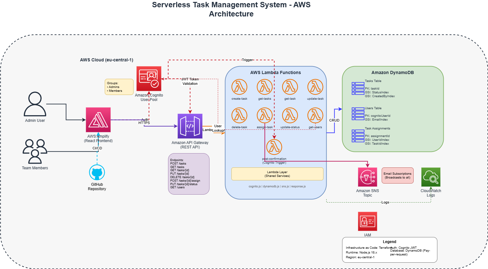

# 🚀 Serverless Task Management System

**A production-grade serverless task management application built on AWS**

[](https://aws.amazon.com/)
[](https://terraform.io/)
[](https://reactjs.org/)
[](https://nodejs.org/)
[]()

> **Features**: Role-based access control, email notifications, real-time updates, and comprehensive monitoring

**🎯 Built for AmaliTech Training Program**

## 🏗️ Detailed Architecture Overview



> 📊 **[View/Edit Interactive Diagram](docs/architecture-diagram.drawio)** - Open with [Draw.io VS Code Extension](https://marketplace.visualstudio.com/items?itemName=hediet.vscode-drawio) or at [app.diagrams.net](https://app.diagrams.net)

```
┌─────────────────────────────────────────────────────────────────────────────────────────────────────────────────┐
│                                              AWS Cloud Infrastructure                                               │
│                                                                                                                     │
│  ┌─────────────────────────────────────────────────────────────────────────────────────────────────────────────┐ │
│  │                                        Frontend Layer                                                          │ │
│  │  ┌──────────────────────────────────────────────────────────────────────────────────────────────────────┐   │ │
│  │  │                                    AWS Amplify                                                          │   │ │
│  │  │  ┌─────────────────┐  ┌─────────────────┐  ┌─────────────────┐  ┌─────────────────┐                   │   │ │
│  │  │  │   React App     │  │   Components    │  │     Pages       │  │    Services     │                   │   │ │
│  │  │  │   (SPA)         │  │   - TaskList    │  │   - Dashboard   │  │   - API Client  │                   │   │ │
│  │  │  │                 │  │   - TaskForm    │  │   - Login       │  │   - Auth        │                   │   │ │
│  │  │  └─────────────────┘  └─────────────────┘  └─────────────────┘  └─────────────────┘                   │   │ │
│  │  └──────────────────────────────────────────────────────────────────────────────────────────────────────┘   │ │
│  └─────────────────────────────────────────────────────────────────────────────────────────────────────────────┘ │
│                                                        │                                                           │
│                                                        │ HTTPS/OAuth2                                              │
│                                                        ▼                                                           │
│  ┌─────────────────────────────────────────────────────────────────────────────────────────────────────────────┐ │
│  │                                      Authentication Layer                                                      │ │
│  │  ┌──────────────────────────────────────────────────────────────────────────────────────────────────────┐   │ │
│  │  │                                   Amazon Cognito                                                        │   │ │
│  │  │  ┌─────────────────┐  ┌─────────────────┐  ┌─────────────────┐  ┌─────────────────┐                   │   │ │
│  │  │  │   User Pool     │  │   App Client    │  │  Hosted UI      │  │ Post-Confirm    │                   │   │ │
│  │  │  │   - Users       │  │   - OAuth2      │  │  - Login/Signup │  │ Lambda Trigger  │                   │   │ │
│  │  │  │   - Groups      │  │   - JWT Tokens  │  │  - Domain Restrict│ │ - Create User   │                   │   │ │
│  │  │  │   - Policies    │  │   - PKCE        │  │  - MFA Support  │  │   in DynamoDB   │                   │   │ │
│  │  │  └─────────────────┘  └─────────────────┘  └─────────────────┘  └─────────────────┘                   │   │ │
│  │  └──────────────────────────────────────────────────────────────────────────────────────────────────────┘   │ │
│  └─────────────────────────────────────────────────────────────────────────────────────────────────────────────┘ │
│                                                        │                                                           │
│                                                        │ JWT Authorization                                         │
│                                                        ▼                                                           │
│  ┌─────────────────────────────────────────────────────────────────────────────────────────────────────────────┐ │
│  │                                         API Layer                                                              │ │
│  │  ┌──────────────────────────────────────────────────────────────────────────────────────────────────────┐   │ │
│  │  │                                 Amazon API Gateway                                                      │   │ │
│  │  │  ┌─────────────────┐  ┌─────────────────┐  ┌─────────────────┐  ┌─────────────────┐                   │   │ │
│  │  │  │   REST API      │  │   Authorizer    │  │   Resources     │  │   CORS Config   │                   │   │ │
│  │  │  │   - Regional    │  │   - Cognito     │  │   /tasks        │  │   - Origins     │                   │   │ │
│  │  │  │   - CloudWatch  │  │   - JWT Valid   │  │   /tasks/{id}   │  │   - Headers     │                   │   │ │
│  │  │  │   - Throttling  │  │   - Role Check  │  │   /users        │  │   - Methods     │                   │   │ │
│  │  │  └─────────────────┘  └─────────────────┘  └─────────────────┘  └─────────────────┘                   │   │ │
│  │  └──────────────────────────────────────────────────────────────────────────────────────────────────────┘   │ │
│  └─────────────────────────────────────────────────────────────────────────────────────────────────────────────┘ │
│                                                        │                                                           │
│                                                        │ Lambda Proxy Integration                                  │
│                                                        ▼                                                           │
│  ┌─────────────────────────────────────────────────────────────────────────────────────────────────────────────┐ │
│  │                                      Business Logic Layer                                                     │ │
│  │  ┌──────────────────────────────────────────────────────────────────────────────────────────────────────┐   │ │
│  │  │                                   AWS Lambda Functions                                                   │   │ │
│  │  │  ┌─────────────────┐  ┌─────────────────┐  ┌─────────────────┐  ┌─────────────────┐                   │   │ │
│  │  │  │   Task CRUD     │  │   User Mgmt     │  │   Assignments   │  │   Notifications │                   │   │ │
│  │  │  │   - create-task │  │   - get-users   │  │   - assign-task │  │   - status-upd  │                   │   │ │
│  │  │  │   - get-tasks   │  │   - post-conf   │  │   - update-stat │  │   - email-send  │                   │   │ │
│  │  │  │   - get-task    │  │                 │  │                 │  │                 │                   │   │ │
│  │  │  │   - update-task │  │                 │  │                 │  │                 │                   │   │ │
│  │  │  │   - delete-task │  │                 │  │                 │  │                 │                   │   │ │
│  │  │  └─────────────────┘  └─────────────────┘  └─────────────────┘  └─────────────────┘                   │   │ │
│  │  │                                                                                                          │   │ │
│  │  │  ┌─────────────────────────────────────────────────────────────────────────────────────────────────┐   │   │ │
│  │  │  │                              Shared Lambda Layer                                                  │   │   │ │
│  │  │  │   - AWS SDK v3    - Validation Utils    - Error Handling    - CORS Headers                      │   │   │ │
│  │  │  └─────────────────────────────────────────────────────────────────────────────────────────────────┘   │   │ │
│  │  └──────────────────────────────────────────────────────────────────────────────────────────────────────┘   │ │
│  └─────────────────────────────────────────────────────────────────────────────────────────────────────────────┘ │
│                                                        │                                                           │
│                                                        │ DynamoDB SDK Calls                                       │
│                                                        ▼                                                           │
│  ┌─────────────────────────────────────────────────────────────────────────────────────────────────────────────┐ │
│  │                                        Data Layer                                                              │ │
│  │  ┌──────────────────────────────────────────────────────────────────────────────────────────────────────┐   │ │
│  │  │                                   Amazon DynamoDB                                                       │   │ │
│  │  │  ┌─────────────────┐  ┌─────────────────┐  ┌─────────────────┐  ┌─────────────────┐                   │   │ │
│  │  │  │   Tasks Table   │  │   Users Table   │  │  Assignments    │  │    Indexes      │                   │   │ │
│  │  │  │   PK: taskId    │  │   PK: userId    │  │   Table         │  │   - StatusIndex │                   │   │ │
│  │  │  │   - title       │  │   - email       │  │   PK: taskId    │  │   - EmailIndex  │                   │   │ │
│  │  │  │   - description │  │   - role        │  │   SK: userId    │  │   - RoleIndex   │                   │   │ │
│  │  │  │   - status      │  │   - name        │  │   - assignedAt  │  │   - CreatedBy   │                   │   │ │
│  │  │  │   - priority    │  │   - isActive    │  │   - status      │  │   - UserAssign  │                   │   │ │
│  │  │  │   - createdBy   │  │   - createdAt   │  │                 │  │                 │                   │   │ │
│  │  │  │   - assignedTo  │  │                 │  │                 │  │                 │                   │   │ │
│  │  │  │   - dueDate     │  │                 │  │                 │  │                 │                   │   │ │
│  │  │  └─────────────────┘  └─────────────────┘  └─────────────────┘  └─────────────────┘                   │   │ │
│  │  └──────────────────────────────────────────────────────────────────────────────────────────────────────┘   │ │
│  └─────────────────────────────────────────────────────────────────────────────────────────────────────────────┘ │
│                                                        │                                                           │
│                                                        │ SNS Publish                                               │
│                                                        ▼                                                           │
│  ┌─────────────────────────────────────────────────────────────────────────────────────────────────────────────┐ │
│  │                                    Notification Layer                                                         │ │
│  │  ┌──────────────────────────────────────────────────────────────────────────────────────────────────────┐   │ │
│  │  │                                      Amazon SNS                                                         │   │ │
│  │  │  ┌─────────────────┐  ┌─────────────────┐  ┌─────────────────┐  ┌─────────────────┐                   │   │ │
│  │  │  │   SNS Topic     │  │ Email Protocol  │  │   Static Subs   │  │   Broadcasts    │                   │   │ │
│  │  │  │   - Task Events │  │   - Subscribers │  │   - Admin Email │  │   - All Subs    │                   │   │ │
│  │  │  │   - Status Upd  │  │   - Confirmaton │  │   - Team Emails │  │   - Per Topic   │                   │   │ │
│  │  │  │   - Assignments │  │   - Delivery    │  │   - From tfvars │  │   - Async       │                   │   │ │
│  │  │  └─────────────────┘  └─────────────────┘  └─────────────────┘  └─────────────────┘                   │   │ │
│  │  └──────────────────────────────────────────────────────────────────────────────────────────────────────┘   │ │
│  └─────────────────────────────────────────────────────────────────────────────────────────────────────────────┘ │
│                                                                                                                     │
│  ┌─────────────────────────────────────────────────────────────────────────────────────────────────────────────┐ │
│  │                                      Monitoring & Logging                                                     │ │
│  │  ┌──────────────────────────────────────────────────────────────────────────────────────────────────────┐   │ │
│  │  │                                   CloudWatch                                                            │   │ │
│  │  │  ┌─────────────────┐  ┌─────────────────┐  ┌─────────────────┐  ┌─────────────────┐                   │   │ │
│  │  │  │   API Logs      │  │   Lambda Logs   │  │   Metrics       │  │   Alarms        │                   │   │ │
│  │  │  │   - Request/Res │  │   - Function    │  │   - Invocations │  │   - Error Rate  │                   │   │ │
│  │  │  │   - Latency     │  │   - Errors      │  │   - Duration    │  │   - Latency     │                   │   │ │
│  │  │  │   - Status Code │  │   - Cold Starts │  │   - Throttles   │  │   - Availability│                   │   │ │
│  │  │  └─────────────────┘  └─────────────────┘  └─────────────────┘  └─────────────────┘                   │   │ │
│  │  └──────────────────────────────────────────────────────────────────────────────────────────────────────┘   │ │
│  └─────────────────────────────────────────────────────────────────────────────────────────────────────────────┘ │
└─────────────────────────────────────────────────────────────────────────────────────────────────────────────────┘
```

### 🔄 Data Flow Architecture

```
┌─────────────┐    ┌─────────────┐    ┌─────────────┐    ┌─────────────┐    ┌─────────────┐
│   Browser   │───▶│   Amplify   │───▶│   Cognito   │───▶│ API Gateway │───▶│   Lambda    │
│   (React)   │    │  (Hosting)  │    │   (Auth)    │    │   (REST)    │    │ (Business)  │
└─────────────┘    └─────────────┘    └─────────────┘    └─────────────┘    └─────────────┘
                                                                                      │
                                                                                      ▼
┌─────────────┐    ┌─────────────┐                       ┌─────────────┐    ┌─────────────┐
│    Email    │◀───│     SNS     │◀──────────────────────│  DynamoDB   │◀───│   Lambda    │
│ Subscribers │    │  (Publish)  │                       │  (Storage)  │    │ (Process)   │
└─────────────┘    └─────────────┘                       └─────────────┘    └─────────────┘
```

## 📋 Features

### User Roles
- **Admin**: Create, update, assign, and close tasks
- **Member**: View assigned tasks and update task status

### Core Functionality
- Task CRUD operations (Admin only for create/delete)
- Task assignment to members
- Status updates with notifications
- Email notifications via AWS SNS
- Role-based access control

### Security
- AWS Cognito authentication
- Email domain restrictions (@amalitech.com, @amalitechtraining.org)
- Email verification required
- API Gateway Cognito authorizers
- Scoped IAM roles per service

## 🛠️ Comprehensive Technology Stack

### Frontend Layer
| Component | Technology | Version | Purpose |
|-----------|------------|---------|----------|
| Framework | React.js | 18.x | SPA development |
| Hosting | AWS Amplify | - | Static site hosting, CI/CD |
| State Management | React Context | - | Global state management |
| HTTP Client | Axios | - | API communication |
| Authentication | AWS Amplify Auth | - | Cognito integration |
| Styling | CSS3 + Flexbox | - | Responsive design |

### Backend Layer
| Component | Technology | Version | Purpose |
|-----------|------------|---------|----------|
| Runtime | Node.js | 18.x | Lambda execution environment |
| Functions | AWS Lambda | - | Serverless compute |
| API Gateway | REST API | v1 | HTTP API endpoints |
| Database | Amazon DynamoDB | - | NoSQL data storage |
| Authentication | Amazon Cognito | - | User management, JWT |
| Notifications | Amazon SNS | - | Event notifications |
| Monitoring | CloudWatch | - | Logging and metrics |

### Infrastructure Layer
| Component | Technology | Version | Purpose |
|-----------|------------|---------|----------|
| IaC | Terraform | 1.5+ | Infrastructure provisioning |
| Provider | AWS Provider | 5.x | AWS resource management |
| State Backend | S3 + DynamoDB | - | Terraform state management |
| Deployment | GitHub Actions | - | CI/CD pipeline |

### Development Tools
| Component | Technology | Purpose |
|-----------|------------|----------|
| Package Manager | npm | Dependency management |
| Code Quality | ESLint | Code linting |
| Testing | Jest | Unit testing |
| Version Control | Git | Source code management |
| IDE | VS Code | Development environment |

## 📁 Detailed Project Structure

```
Serverless_Task_Management_System/
├── terraform/                           # Infrastructure as Code
│   ├── modules/                        # Reusable Terraform modules
│   │   ├── amplify/                   # AWS Amplify hosting
│   │   │   ├── main.tf               # Amplify app, branch, domain
│   │   │   ├── variables.tf          # GitHub integration vars
│   │   │   └── outputs.tf            # App URL, domain
│   │   ├── api-gateway/              # REST API Gateway
│   │   │   ├── main.tf               # API, resources, methods, CORS
│   │   │   ├── variables.tf          # Lambda ARNs, Cognito config
│   │   │   └── outputs.tf            # API endpoint, stage
│   │   ├── cognito/                  # Authentication service
│   │   │   ├── main.tf               # User pool, client, domain
│   │   │   ├── lambda/               # Post-confirmation trigger
│   │   │   ├── variables.tf          # Domain restrictions, callbacks
│   │   │   └── outputs.tf            # Pool ID, client ID, ARN
│   │   ├── dynamodb/                 # NoSQL database
│   │   │   ├── main.tf               # Tables: tasks, users, assignments
│   │   │   ├── variables.tf          # Table configuration
│   │   │   └── outputs.tf            # Table names, ARNs
│   │   ├── lambda/                   # Serverless functions
│   │   │   ├── functions/            # Individual function code
│   │   │   │   ├── create-task/      # POST /tasks
│   │   │   │   ├── get-tasks/        # GET /tasks
│   │   │   │   ├── get-task/         # GET /tasks/{id}
│   │   │   │   ├── update-task/      # PUT /tasks/{id}
│   │   │   │   ├── delete-task/      # DELETE /tasks/{id}
│   │   │   │   ├── assign-task/      # POST /tasks/{id}/assign
│   │   │   │   ├── update-status/    # PUT /tasks/{id}/status
│   │   │   │   ├── get-users/        # GET /users
│   │   │   │   └── post-confirmation/ # Cognito trigger
│   │   │   ├── layer/                # Shared dependencies
│   │   │   │   └── nodejs/           # AWS SDK, utilities
│   │   │   ├── src/                  # Shared source code
│   │   │   ├── main.tf               # Function definitions, IAM
│   │   │   ├── variables.tf          # Environment, table configs
│   │   │   └── outputs.tf            # Function ARNs, names
│   │   ├── ses/                      # Email service
│   │   │   ├── main.tf               # SES domain, identity
│   │   │   ├── variables.tf          # Domain, from email
│   │   │   └── outputs.tf            # SES ARN, domain status
│   │   └── sns/                      # Notification service
│   │       ├── main.tf               # SNS topic, subscriptions
│   │       ├── variables.tf          # Notification emails
│   │       └── outputs.tf            # Topic ARN
│   ├── environments/                 # Environment configurations
│   │   └── dev/                     # Development environment
│   │       ├── main.tf              # Environment-specific config
│   │       ├── terraform.tfvars     # Variable values
│   │       └── backend.tf           # State backend config
│   ├── main.tf                      # Root module orchestration
│   ├── variables.tf                 # Global variables
│   ├── outputs.tf                   # Infrastructure outputs
│   └── terraform.tfvars.example     # Example configuration
├── backend/                         # Lambda function source
│   ├── src/                        # Source code
│   │   ├── services/               # Business logic services
│   │   │   ├── taskService.js      # Task CRUD operations
│   │   │   ├── userService.js      # User management
│   │   │   └── notificationService.js # Email notifications
│   │   └── utils/                  # Utility functions
│   │       ├── dynamodb.js         # DynamoDB helpers
│   │       ├── validation.js       # Input validation
│   │       ├── auth.js             # JWT token handling
│   │       └── response.js         # HTTP response helpers
│   ├── package.json                # Dependencies
│   └── .env.example               # Environment variables
├── frontend/                       # React SPA
│   ├── public/                    # Static assets
│   │   └── index.html            # HTML template
│   ├── src/                      # React source code
│   │   ├── components/           # Reusable components
│   │   │   ├── TaskList.js       # Task listing component
│   │   │   ├── TaskForm.js       # Task creation/edit form
│   │   │   ├── TaskCard.js       # Individual task display
│   │   │   └── UserSelect.js     # User selection dropdown
│   │   ├── pages/                # Page components
│   │   │   ├── Dashboard.js      # Main dashboard
│   │   │   ├── Login.js          # Authentication page
│   │   │   ├── TaskDetails.js    # Task detail view
│   │   │   └── Profile.js        # User profile
│   │   ├── services/             # API integration
│   │   │   ├── api.js            # Axios configuration
│   │   │   ├── taskService.js    # Task API calls
│   │   │   ├── userService.js    # User API calls
│   │   │   └── authService.js    # Authentication service
│   │   ├── context/              # React Context
│   │   │   ├── AuthContext.js    # Authentication state
│   │   │   └── TaskContext.js    # Task management state
│   │   ├── hooks/                # Custom React hooks
│   │   ├── utils/                # Frontend utilities
│   │   ├── aws-config.js         # AWS Amplify configuration
│   │   ├── App.js                # Main application component
│   │   └── index.js              # Application entry point
│   ├── package.json              # Frontend dependencies
│   ├── .env                      # Environment variables
│   └── .env.example             # Example configuration
├── scripts/                        # Automation scripts
│   ├── deploy.sh                  # Full deployment script
│   ├── deploy.bat                 # Windows deployment
│   ├── destroy.sh                 # Infrastructure cleanup
│   ├── setup-ses.sh              # SES domain verification
│   ├── create-admin.sh           # Create admin user
│   ├── verify-email.sh           # Email verification
│   ├── test-status-update.js     # API testing script
│   ├── check-logs.bat            # CloudWatch log viewer
│   └── build.js                  # Build automation
├── .gitignore                     # Git ignore rules
├── .gitattributes                # Git attributes
├── README.md                     # Project documentation
└── SETUP.md                      # Setup instructions
```

## 🚀 Complete Deployment Guide

### Prerequisites
- AWS CLI configured with sandbox credentials
- Terraform >= 1.5.0
- Node.js >= 18.x
- npm >= 9.x
- Git configured
- GitHub account (for Amplify)

### 1. Initial Setup
```bash
# Clone repository
git clone <repository-url>
cd Serverless_Task_Management_System

# Configure AWS credentials
aws configure
# Enter your AWS Sandbox credentials

# Verify AWS access
aws sts get-caller-identity
```

### 2. Configure Environment
```bash
# Copy configuration templates
cp terraform/terraform.tfvars.example terraform/terraform.tfvars
cp frontend/.env.example frontend/.env
cp backend/.env.example backend/.env

# Edit terraform variables
vim terraform/terraform.tfvars
# Update: email domains, SES settings, GitHub token
```

### 3. Deploy Infrastructure
```bash
cd terraform

# Initialize Terraform
terraform init

# Review deployment plan
terraform plan

# Deploy infrastructure
terraform apply
# Type 'yes' to confirm

# Save outputs for frontend configuration
terraform output > ../frontend/.env.terraform
```

### 4. Configure SES (Email Service)
```bash
# Verify SES domain (if using custom domain)
./scripts/setup-ses.sh

# Verify admin email address
./scripts/verify-email.sh admin@amalitech.com
```

### 5. Deploy Lambda Functions
```bash
cd backend

# Install dependencies
npm install

# Deploy functions (handled by Terraform)
# Functions are automatically deployed with infrastructure
```

### 6. Deploy Frontend
```bash
cd frontend

# Install dependencies
npm install

# Update environment variables from Terraform outputs
# (Amplify will handle deployment via GitHub integration)

# For local development
npm start
```

### 7. Create Admin User
```bash
# Create first admin user
./scripts/create-admin.sh admin@amalitech.com "Admin User"
```

### 8. Verify Deployment
```bash
# Test API endpoints
node scripts/test-status-update.js

# Check CloudWatch logs
./scripts/check-logs.bat

# Access application
echo "Frontend URL: $(terraform output amplify_branch_url)"
echo "API URL: $(terraform output api_gateway_url)"
```

### 9. Automated Deployment (Optional)
```bash
# Use deployment script for full automation
./scripts/deploy.sh

# For Windows
./scripts/deploy.bat
```

### 10. Cleanup (When Done)
```bash
# Destroy all resources
terraform destroy
# Type 'yes' to confirm

# Or use cleanup script
./scripts/destroy.sh
```

## 🔒 Security & Access Control

### Email Domain Restrictions
Only the following email domains are allowed for signup:
- `@amalitech.com`
- `@amalitechtraining.org`

### Role-Based Access Control (RBAC)

#### Admin Role Permissions
- ✅ Create tasks
- ✅ View all tasks
- ✅ Update any task
- ✅ Delete tasks
- ✅ Assign tasks to members
- ✅ Update task status
- ✅ View all users
- ✅ Receive all notifications

#### Member Role Permissions
- ❌ Create tasks
- ✅ View assigned tasks only
- ✅ Update assigned task details (limited)
- ❌ Delete tasks
- ❌ Assign tasks
- ✅ Update status of assigned tasks
- ❌ View all users
- ✅ Receive assignment notifications

### Security Features
- **JWT Authentication**: All API endpoints protected
- **Cognito Authorizer**: API Gateway integration
- **Email Verification**: Required for account activation
- **HTTPS Only**: All communications encrypted
- **CORS Configuration**: Restricted origins
- **IAM Roles**: Least privilege access
- **DynamoDB Encryption**: Server-side encryption enabled
- **Lambda Security**: VPC isolation (optional)
- **API Throttling**: Rate limiting enabled

## 🔐 API Endpoints

### Task Management Endpoints
| Method | Endpoint | Access | Lambda Function | Description |
|--------|----------|--------|-----------------|-------------|
| POST | /tasks | Admin | create-task | Create a new task |
| GET | /tasks | All | get-tasks | Get all tasks (filtered by role) |
| GET | /tasks/{id} | All | get-task | Get task by ID |
| PUT | /tasks/{id} | All | update-task | Update task details |
| DELETE | /tasks/{id} | Admin | delete-task | Delete task |
| POST | /tasks/{id}/assign | Admin | assign-task | Assign task to members |
| PUT | /tasks/{id}/status | All | update-status | Update task status |

### User Management Endpoints
| Method | Endpoint | Access | Lambda Function | Description |
|--------|----------|--------|-----------------|-------------|
| GET | /users | Admin | get-users | Get all users |

### Authentication Flow
| Trigger | Function | Description |
|---------|----------|-------------|
| Post-Confirmation | post-confirmation | Create user record in DynamoDB after Cognito signup |

## 📊 DynamoDB Schema

### Tasks Table (`tms-dev-tasks-{suffix}`)
| Attribute | Type | Key | Description |
|-----------|------|-----|-------------|
| taskId | String | PK | Unique task identifier (UUID) |
| title | String | - | Task title |
| description | String | - | Task description |
| status | String | GSI-PK | OPEN, IN_PROGRESS, COMPLETED, CLOSED |
| priority | String | - | LOW, MEDIUM, HIGH |
| createdBy | String | GSI-PK | Admin user ID (Cognito sub) |
| createdAt | String | GSI-SK | ISO timestamp |
| updatedAt | String | - | ISO timestamp |
| dueDate | String | - | Task due date (ISO) |
| assignedMembers | List | - | List of assigned user IDs |
| ttl | Number | - | TTL for task archival (optional) |

**Global Secondary Indexes:**
- `StatusIndex`: status (PK) + createdAt (SK)
- `CreatedByIndex`: createdBy (PK) + createdAt (SK)

### Users Table (`tms-dev-users-{suffix}`)
| Attribute | Type | Key | Description |
|-----------|------|-----|-------------|
| userId | String | PK | Cognito user sub |
| email | String | GSI-PK | User email address |
| role | String | GSI-PK | ADMIN or MEMBER |
| name | String | - | User full name |
| isActive | Boolean | - | Account status |
| createdAt | String | - | ISO timestamp |

**Global Secondary Indexes:**
- `EmailIndex`: email (PK)
- `RoleIndex`: role (PK)

### Task Assignments Table (`tms-dev-task-assignments-{suffix}`)
| Attribute | Type | Key | Description |
|-----------|------|-----|-------------|
| taskId | String | PK | Task identifier |
| userId | String | SK | User identifier |
| assignedAt | String | - | Assignment timestamp |
| assignedBy | String | - | Admin who assigned |
| status | String | - | Assignment status |

**Global Secondary Indexes:**
- `UserAssignmentsIndex`: userId (PK) + taskId (SK)

## 🔔 Notification System

### SNS Topic Architecture
```
┌─────────────────┐    ┌─────────────────┐    ┌─────────────────┐
│   Lambda        │───▶│   SNS Topic     │───▶│   SES Service   │
│   Functions     │    │   (Events)      │    │   (Email)       │
└─────────────────┘    └─────────────────┘    └─────────────────┘
                                │
                                ▼
                       ┌─────────────────┐
                       │   Subscribers   │
                       │   - Admin       │
                       │   - Members     │
                       └─────────────────┘
```

### Email Notifications
Notifications are sent via **Amazon SNS** for:

1. **Task Assignment** (`assign-task` Lambda)
   - Recipient: Assigned member(s)
   - Content: Task details, due date, priority
   - Trigger: POST /tasks/{id}/assign

2. **Status Updates** (`update-status` Lambda)
   - Recipients: Admin + all assigned members
   - Content: Task status change, updated by
   - Trigger: PUT /tasks/{id}/status

3. **Task Creation** (`create-task` Lambda)
   - Recipients: Admin notification list
   - Content: New task created
   - Trigger: POST /tasks

### SNS Configuration
- **Topic**: Task management notifications
- **Subscriptions**: Email endpoints
- **Message Format**: JSON with email content

## 🧪 Testing Strategy

### Backend Testing
```bash
# Unit tests for Lambda functions
cd backend
npm install
npm test

# Integration tests
npm run test:integration

# API endpoint testing
node scripts/test-status-update.js
```

### Frontend Testing
```bash
# React component tests
cd frontend
npm install
npm test

# E2E tests
npm run test:e2e

# Coverage report
npm run test:coverage
```

### Infrastructure Testing
```bash
# Terraform validation
cd terraform
terraform validate
terraform plan

# Security scanning
terraform plan -out=plan.out
tfsec plan.out
```

### Manual Testing Checklist
- [ ] User registration with valid/invalid domains
- [ ] Admin task creation and assignment
- [ ] Member task status updates
- [ ] Email notification delivery
- [ ] Role-based access restrictions
- [ ] API error handling
- [ ] Frontend responsive design

## 📝 Environment Configuration

### Terraform Variables (`terraform.tfvars`)
```hcl
# Core Configuration
aws_region = "us-east-1"
environment = "dev"

# Cognito Configuration
allowed_email_domains = ["amalitech.com", "amalitechtraining.org"]
cognito_callback_urls = ["http://localhost:3000/callback"]
cognito_logout_urls = ["http://localhost:3000/logout"]

# SNS Configuration
notification_emails = ["admin@amalitech.com"]

# CORS Configuration
cors_allowed_origins = ["http://localhost:3000", "https://yourdomain.com"]

# Amplify Configuration
frontend_repository_url = "https://github.com/username/repo"
github_access_token = "ghp_xxxxxxxxxxxx"
frontend_branch_name = "main"
```

### Backend Environment (Lambda)
```bash
# Automatically set by Terraform
AWS_REGION=us-east-1
TASKS_TABLE_NAME=tms-dev-tasks-a1b2c3d4
USERS_TABLE_NAME=tms-dev-users-a1b2c3d4
TASK_ASSIGNMENTS_TABLE_NAME=tms-dev-task-assignments-a1b2c3d4
SNS_TOPIC_ARN=arn:aws:sns:us-east-1:123456789012:tms-dev-notifications
COGNITO_USER_POOL_ID=us-east-1_XXXXXXXXX
CORS_ALLOWED_ORIGIN=http://localhost:3000
```

### Frontend Environment (`.env`)
```bash
# Generated by Terraform outputs
REACT_APP_API_URL=https://xxxxxxxxxx.execute-api.us-east-1.amazonaws.com/dev
REACT_APP_COGNITO_USER_POOL_ID=us-east-1_XXXXXXXXX
REACT_APP_COGNITO_CLIENT_ID=xxxxxxxxxxxxxxxxxxxxxxxxxx
REACT_APP_COGNITO_DOMAIN=tms-dev-auth-a1b2c3d4.auth.us-east-1.amazoncognito.com
REACT_APP_AWS_REGION=us-east-1
```

### Development Environment Setup
```bash
# Copy example files
cp terraform/terraform.tfvars.example terraform/terraform.tfvars
cp frontend/.env.example frontend/.env
cp backend/.env.example backend/.env

# Edit with your values
vim terraform/terraform.tfvars
```

## 🤝 Contributing

### Development Workflow
1. Fork the repository
2. Create feature branch (`git checkout -b feature/amazing-feature`)
3. Commit changes (`git commit -m 'Add amazing feature'`)
4. Push to branch (`git push origin feature/amazing-feature`)
5. Open Pull Request

### Code Standards
- **JavaScript**: ESLint configuration
- **Terraform**: terraform fmt
- **Commit Messages**: Conventional commits
- **Documentation**: Update README for changes

### Testing Requirements
- Unit tests for Lambda functions
- Integration tests for API endpoints
- Frontend component tests
- Infrastructure validation

---

## 👥 Contributors

**AmaliTech Training Team**
- Solution Architecture
- Infrastructure Design
- Code Review & Mentoring

**Trainees**
- Implementation
- Testing
- Documentation

---

## 📄 License

This project is for **educational purposes** as part of AmaliTech training program.

**Usage Rights:**
- ✅ Learning and educational use
- ✅ Portfolio demonstration
- ✅ Code reference and study
- ❌ Commercial use
- ❌ Production deployment without permission

---

## 📞 Support

### Getting Help
- **Documentation**: Check README.md and SETUP.md
- **Issues**: Create GitHub issue with detailed description
- **Training Support**: Contact AmaliTech training team

### Troubleshooting
- **Infrastructure Issues**: Check Terraform logs
- **API Errors**: Review CloudWatch logs
- **Frontend Issues**: Check browser console
- **Authentication**: Verify Cognito configuration

### Resources
- [AWS Documentation](https://docs.aws.amazon.com/)
- [Terraform AWS Provider](https://registry.terraform.io/providers/hashicorp/aws/latest/docs)
- [React Documentation](https://reactjs.org/docs/)
- [AmaliTech Training Portal](https://training.amalitech.com/)

## 📈 Monitoring & Observability

### CloudWatch Integration
- **API Gateway Logs**: Request/response logging
- **Lambda Logs**: Function execution logs
- **DynamoDB Metrics**: Read/write capacity, throttling
- **Cognito Metrics**: Authentication events

### Key Metrics to Monitor
- API response times
- Lambda cold starts
- DynamoDB throttling
- Email delivery rates
- User authentication failures
- Task creation/completion rates

### Alerting
- High error rates
- API latency spikes
- Lambda timeout errors
- DynamoDB capacity issues
- SES bounce rate threshold

---

## 🔄 CI/CD Pipeline

### GitHub Actions Workflow
```yaml
# .github/workflows/deploy.yml
name: Deploy Task Management System
on:
  push:
    branches: [main]
  pull_request:
    branches: [main]

jobs:
  terraform:
    runs-on: ubuntu-latest
    steps:
      - uses: actions/checkout@v3
      - uses: hashicorp/setup-terraform@v2
      - run: terraform init
      - run: terraform plan
      - run: terraform apply -auto-approve
        if: github.ref == 'refs/heads/main'

  frontend:
    runs-on: ubuntu-latest
    steps:
      - uses: actions/checkout@v3
      - uses: actions/setup-node@v3
      - run: npm ci
      - run: npm test
      - run: npm run build
```

---

## 🎯 Performance Optimization

### Lambda Optimizations
- **Provisioned Concurrency**: For frequently used functions
- **Lambda Layers**: Shared dependencies
- **Connection Pooling**: DynamoDB connections
- **Memory Allocation**: Right-sized for workload

### DynamoDB Optimizations
- **On-Demand Billing**: Auto-scaling capacity
- **Global Secondary Indexes**: Efficient queries
- **Partition Key Design**: Even distribution
- **Item Size**: Optimized for access patterns

### Frontend Optimizations
- **Code Splitting**: Lazy loading
- **Caching**: API response caching
- **CDN**: Amplify CloudFront distribution
- **Bundle Size**: Tree shaking, minification

---

**Project Deadline**: February 20, 2026  
**Documentation Version**: 2.0  
**Last Updated**: January 2025
